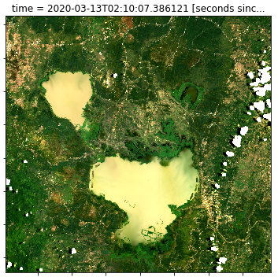

# EOCSI Hackathon 2022 

Notebooks and materials for the EOCSI Hackathon 2022, https://frontiersi.com.au/climate-innovation-hack/

- Use the examples in these notebooks to build your own data analysis and applications.
- These notebooks have been adapted and written for [CSIRO's EASI SE Asia
platform](https://research.csiro.au/cceo/building-new-earth-observation-capabilities-in-the-south-east-asian-region/).

<!--
<figure align="right">
    
    <figcaption><i>Lake Tempe, Indonesia. Landsat-8 (2020-03-13) RGB</i></figcaption>
</figure>
-->

## HTML notebooks

> `main` branch by default. Edit a URL for a specific branch, or go to https://raw.githack.com/.

1. [01-welcome-to-easi.html](https://raw.githack.com/csiro-easi/eocsi-hackathon-2022/main/html/01-welcome-to-easi.html)
1. [case-studies/water-observations-from-space.html](https://raw.githack.com/csiro-easi/eocsi-hackathon-2022/main/html/case-studies/water-observations-from-space.html)
1. [tutorials/Datasets_and_xarray.html](https://raw.githack.com/csiro-easi/eocsi-hackathon-2022/main/html/tutorials/Datasets_and_xarray.html)
1. [tutorials/Analyse_visualise_export.html](https://raw.githack.com/csiro-easi/eocsi-hackathon-2022/main/html/tutorials/Analyse_visualise_export.html)
1. [tutorials/SAR_data.html](https://raw.githack.com/csiro-easi/eocsi-hackathon-2022/main/html/tutorials/SAR_data.html)